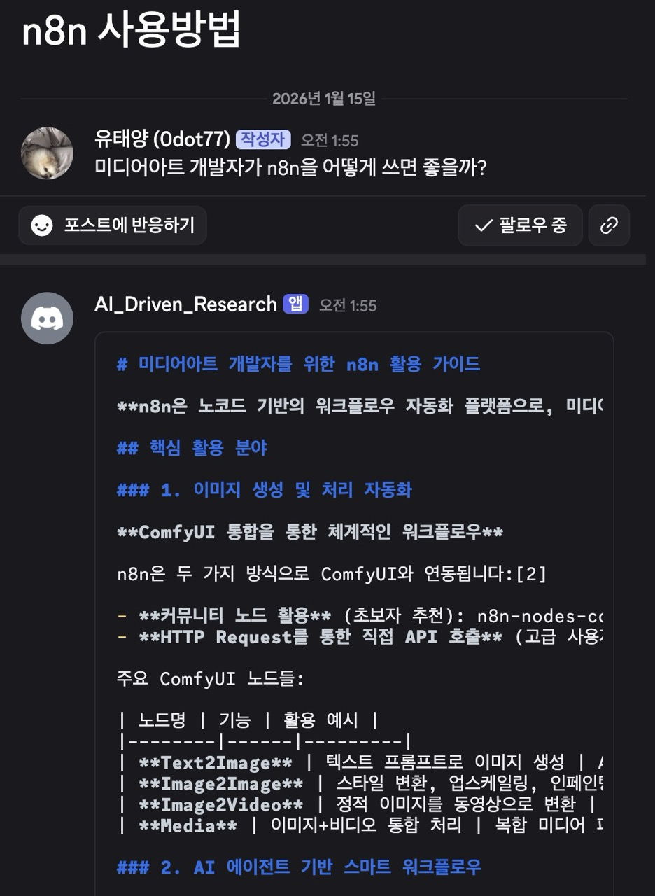
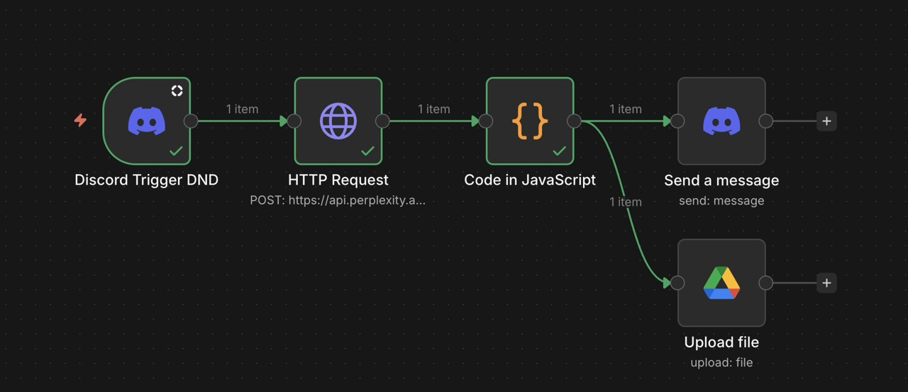
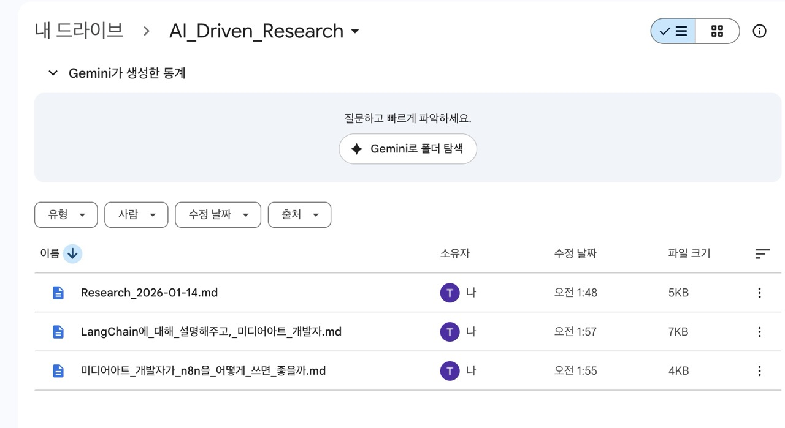

## Tools

- **작업에 사용될 툴**

1. Discord
2. n8n
3. NotebookLM
4. Goolge Drive

---

## 0. Result

### 디스코드 요청

  

### n8n 노드 구성

  

### 구글 드라이브 저장

  

---

## 🏁 Day 1: Hypothesis (가설 & 기획)
> 디스코드에 질문을 올리면 봇이 알아서 체크해서 분석 및 리서치 작업 진행해줄 수 있을까?

### 🎯 Goal

1. 디스코드 포럼에 질문 올리기
2. 봇 질문을 트리거로 해서 로컬에서 n8n 실행
3. Perplexity로 리서치 진행
4. 리서치 결과물 .md 로 저장
5. 해당 파일을 Google Drive, Discord에 저장

### 🛠 1일차 배운 것

- n8n Discord community node
  - 일반 노드에는 트리거 기능이 존재하지 않음
  - `n8n-discord-dnd` 패키지를 사용해서 작업함
    - 디스코드를 봇이 계속 바라보면서 질문이 올라오면 바로 트리거가 동작할 수 있도록 함

- Discord Bot 설정
  - Credential 설정 같은 것들 도큐먼트를 참고해야 할 것들이 많음

- n8n Execute
  - n8n은 publish 된 이후에 백그라운드에서 자동으로 실행됨
    - 실행되는게 바로 표기되지는 않고, Log를 보면 찍히는 것이 바로 등장함

- Google Drive 인증
  - auth 설정 시, re-direction에 n8n에서 부여한 링크 삽입해야 함
  - test user 도 나의 이메일로 등록해야 가능함

---

## 🔗 Links
* [GitHub Repository](https://github.com/0dot77/3DaySprints/tree/main/sprint-003)

